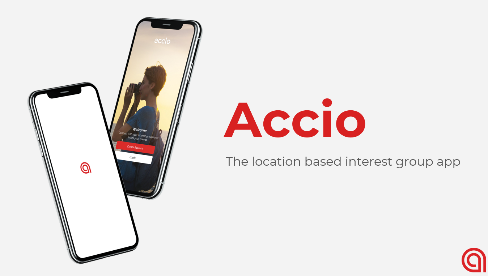

# Accio
Accio the location-based interest app. Implemented with MERN stack: MongoDB, Express.js, React Native, Node.js.

## Pitch
Our app seeks to address the never ending need to find community. Even without quarantine, there is a global epidemic of people feeling isolated from one another. Where are you supposed to go to find YOUR people? Which bar, which park, which record store are you supposed to go to? Instead of you hopping cafe to cafe hoping that you’ll happen upon someone with your eclectic taste in coffee, our app brings them to you. Our app lets you join groups of people with similar interests and actually see where they are in the moment. Unlike other event and group based apps, Accio thrives in the right now. Any app can tell you what is going on next Friday, or what event you missed yesterday, but only Accio will tell you which friends want to do something right now. 

## Product overview
* Join interest groups or create your new group
* Connect with people
* Leave the group
* Create a future event
* RSVP to an upcoming event 
* Post a discussion
* **Go Live** when you are doing an activity

## The *Accio LLC* team
The co-founders of the *Accio LLC* are nine students of CSE 437: Software Engineering Workshop (Spring 2020) at Washington University in St. Louis.
* Product Manager: Steven Lee
* Build Master: Pyi Theim Kyaw
* Developer
  * **Linghan Zhu**
  * Henry Arneson
  * Minh Vu
  * Casey Mason
  * Khin Wai Phyo Han
  * Kaitlin Clark
* User tester: Hamish McGregor

## My responsibilities
As a front-end developer, I built several interactive core features, and helped other team members resolving development issues.
* Inspired the name of our team
* Layout of the drawers
* The group drawer - group discussions, etc..
* The event drawer - create, join, etc..
* Navigation between screens

## Tech stack
* MERN stack
  * MongoDB to utilize NoSQL database
  * Express.js for API endpoints
  * React Native for cross-platform app development
  * Node.js server running on AWS EC2 instance
* Redux.js for frontend state management
* Native Base cross-platform UI components for the frontend

---
*I really loved our team. Hope we can continue building the app and publish it one day. One of the most delightful project to work on during the Covid-19.*

